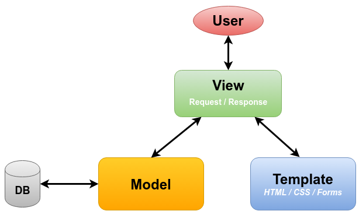
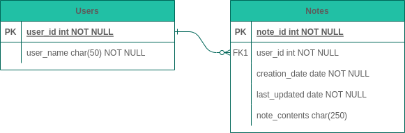

# To Do App 🖊️

A web application that allows a user to maintain a "to do" list made using Django and Python.

## Setting goals for this side project 🎯
The goal of this project is to use the Feynman Technique to further my understanding of Python, Django, Relational
Databases and software engineering. By creating sections in the readme that will go in to detail about the decisions I
have made and how they enable functionality within this project. You may ask why these technologies/tools? These are the 
tools I use in my day job and wish to gain a deeper understanding of them and become more proficient as a software
engineer. The project is over when all the functionality is met below with the adequate testing.

## Functionality requirements
The application allows a user to have an individual account, that will store individual jobs. The user can execute CRUD 
operations against these jobs (create, read, update and delete). Notes can also be filtered on the date created, jobs 
complete/incomplete, alphabetical order, ascending and descending and a job tagging system. where users are able to tag 
their jobs with things like "house-work" or "studying". Then filter on these tags.

## What is Django
Django is a web framework that allows us to implement the MVT software architectural pattern with its large amount of
inbuilt libraries to rapidly develop web applications.

## Model, View, Template
Django follows a software architectural pattern similar to MVC(model, view controller) but instead we call the 
controller the view and the view a template so refer to it as MVT(model, view, template).

The model is a mapping to our database tables this is also how we interact with the database through Django's ORM
(Object Relational Mapping) creating, reading, updating and deleting data. 

## Database
For the RDBMS (Relational Database Management System) I have chosen Postgres again as this is the database I use in my 
day job. I would use Postgres anyway as it is opensource and the online community for Django+Postgres is large along 
with its extensive support in the Django ORM(Object Relational Mapping). The reason I did not want to use SQLite3 is 
because I have already used this for a project, plus not likely to be used in a production setting. 

## Entity relationship diagram
To show the relationship and plan out our database I have created an ERD (Entity Relationship Diagram) to show the
relationship between database objects. These tables are represented by models at the Django level and controlled through
the Django ORM.

